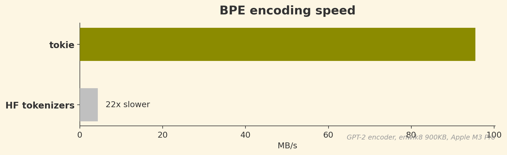

<div align="center">


# tokie

[](https://crates.io/crates/tokie)
[](https://pypi.org/project/tokie/)
[](https://crates.io/crates/tokie)
[](https://pypi.org/project/tokie/)
[](LICENSE-MIT)
[](https://docs.rs/tokie)
[](https://github.com/chonkie-inc/tokie)

*10-20x faster than HuggingFace, 2-4x faster than kitoken, 100% accurate drop-in replacement*

[Install](#install) •
[Quick Start](#quick-start) •
[Examples](#examples) •
[Benchmarks](#benchmarks) •
[Why tokie?](#why-tokie)

</div>

> [!CAUTION]
> tokie is in its alpha stage and might produce mis-aligned output. Please report any issues you encounter.

**tokie** is a Rust tokenizer library (with Python bindings) that can load any tokenizer on HuggingFace and tokenize 10-20x faster than HuggingFace tokenizers and 2-4x faster than kitoken. It supports every major algorithm — BPE, WordPiece, SentencePiece, and Unigram — and is 100% token-accurate, every time.


## Install

### Python

```bash
pip install tokie
```

### Rust

```toml
[dependencies]
tokie = { version = "0.0.7", features = ["hf"] }
```

## Quick Start

### Python

```python
import tokie

# Load any HuggingFace tokenizer
tokenizer = tokie.Tokenizer.from_pretrained("bert-base-uncased")

# Encode — returns Encoding with ids, attention_mask, type_ids, tokens
encoding = tokenizer("Hello, world!")  # or tokenizer.encode("Hello, world!")
print(encoding.ids)             # [101, 7592, 1010, 2088, 999, 102]
print(encoding.tokens)          # ['[CLS]', 'hello', ',', 'world', '!', '[SEP]']
print(encoding.attention_mask)  # [1, 1, 1, 1, 1, 1]

# Decode
text = tokenizer.decode(encoding.ids)  # "hello , world !"

# Count tokens without allocating
count = tokenizer.count_tokens("Hello, world!")  # 6

# Batch encode (parallel across all cores)
encodings = tokenizer.encode_batch(["Hello!", "World"], add_special_tokens=True)
```

### Rust

```rust
use tokie::Tokenizer;

let tokenizer = Tokenizer::from_pretrained("bert-base-uncased")?;
let encoding = tokenizer.encode("Hello, world!", true);
println!("{:?}", encoding.ids);             // [101, 7592, 1010, 2088, 999, 102]
println!("{:?}", encoding.attention_mask);  // [1, 1, 1, 1, 1, 1]

let text = tokenizer.decode(&encoding.ids).unwrap();
```

## Examples

### Padding & Truncation

For ML inference, you need fixed-length inputs. tokie supports padding and truncation just like HuggingFace:

```python
tokenizer = tokie.Tokenizer.from_pretrained("bert-base-uncased")

# Truncate to max length
tokenizer.enable_truncation(max_length=128)

# Pad to fixed length (or use BatchLongest for dynamic padding)
tokenizer.enable_padding(length=128, pad_id=0)

# All outputs are now exactly 128 tokens
results = tokenizer.encode_batch(["Short text", "A much longer piece of text for testing"])
assert all(len(r) == 128 for r in results)

# attention_mask shows which tokens are real (1) vs padding (0)
print(results[0].attention_mask)  # [1, 1, 1, 1, 0, 0, 0, ...]
```

### Cross-Encoder Pair Encoding

For rerankers and cross-encoders that need sentence pairs with token type IDs:

```python
pair = tokenizer("How are you?", "I am fine.")  # or tokenizer.encode_pair(...)
pair.ids               # [101, 2129, 2024, 2017, 1029, 102, 1045, 2572, 2986, 1012, 102]
pair.attention_mask    # [1, 1, 1, 1, 1, 1, 1, 1, 1, 1, 1]
pair.type_ids          # [0, 0, 0, 0, 0, 0, 1, 1, 1, 1, 1]
pair.special_tokens_mask  # [1, 0, 0, 0, 0, 1, 0, 0, 0, 0, 1]
```

### Byte Offsets

Track where each token maps back to in the original text:

```python
enc = tokenizer.encode_with_offsets("Hello world")
for token_id, (start, end) in zip(enc.ids, enc.offsets):
    print(f"  token {token_id}: bytes [{start}:{end}]")
```

### Vocabulary Access

```python
tokenizer.vocab_size          # 30522
tokenizer.id_to_token(101)    # "[CLS]"
tokenizer.token_to_id("[SEP]")  # 102
vocab = tokenizer.get_vocab()   # {"[CLS]": 101, "[SEP]": 102, ...}
```

### Save and Load `.tkz` Files

tokie's binary format is ~10x smaller than `tokenizer.json` and loads in ~5ms:

```python
tokenizer.save("model.tkz")
tokenizer = tokie.Tokenizer.from_file("model.tkz")
```

`from_pretrained()` automatically tries `.tkz` first, falling back to `tokenizer.json`.

## Benchmarks

All benchmarks run on 1 MB of enwik8 on an Apple M3 Pro. tokie produces **identical output** to HuggingFace tokenizers — every token matches, every time.

### BPE Encoding (GPT-2, Llama, Qwen, ModernBERT)

For tiktoken-style BPE models, tokie uses a backtracking encoder built on an Aho-Corasick automaton. Instead of iteratively merging byte pairs, it does a greedy longest-match in O(n) time, with backtracking only when adjacent tokens form invalid pairs. Combined with parallel chunking across all cores and hand-coded pretokenizers from [pretokie](https://crates.io/crates/pretokie), this gives **10-17x faster** than HuggingFace and **1.4-3.1x faster** than kitoken.



### WordPiece (BERT, MiniLM, BGE, GTE)

WordPiece tokenizers use a different algorithm — greedy longest-match prefix search over a vocabulary trie. tokie uses a pre-built Double-Array trie for O(n) lookup with excellent cache locality, combined with a specialized BERT pretokenizer. The result is **15-20x faster** than HuggingFace and **2.9-3.6x faster** than kitoken on BERT, with identical output.


### SentencePiece BPE & Unigram (Gemma, XLM-R, T5)

SentencePiece-style models use a different merge algorithm with non-topological rank orders. tokie uses a radix heap with O(1) amortized operations that exploits BPE's monotonic rank property. tokie is **1.3x faster** than HuggingFace on Gemma 3. Note: kitoken appears faster in raw throughput but produces incorrect output on SentencePiece models (13% more tokens, mismatches starting at token 93 on Gemma 3).


### Python Benchmarks

All results on Apple M3 Pro, single-string encode, median of 10 runs.

#### tokie vs HuggingFace tokenizers vs kitoken

| Model | Text Size | tokie | HF tokenizers | kitoken | vs HF | vs kitoken |
|-------|-----------|-------|---------------|---------|-------|------------|
| BERT | 45 KB | 0.76 ms | 11.2 ms | 2.19 ms | **15x** | **2.9x** |
| BERT | 900 KB | 14.3 ms | 279 ms | 51.8 ms | **20x** | **3.6x** |
| GPT-2 | 45 KB | 0.91 ms | 8.34 ms | 1.27 ms | **9x** | **1.4x** |
| GPT-2 | 900 KB | 15.8 ms | 246 ms | 29.8 ms | **16x** | **1.9x** |
| Llama 3 | 45 KB | 0.84 ms | 8.60 ms | 1.58 ms | **10x** | **1.9x** |
| Llama 3 | 900 KB | 15.0 ms | 222 ms | 35.1 ms | **15x** | **2.3x** |
| Qwen 3 | 45 KB | 0.84 ms | 9.80 ms | 2.22 ms | **12x** | **2.6x** |
| Qwen 3 | 900 KB | 15.8 ms | 270 ms | 49.3 ms | **17x** | **3.1x** |
| ModernBERT | 45 KB | 1.11 ms | 10.0 ms | 1.76 ms | **9x** | **1.6x** |
| ModernBERT | 900 KB | 26.7 ms | 276 ms | 50.7 ms | **10x** | **1.9x** |
| Gemma 3 | 45 KB | 9.29 ms | 10.6 ms | 5.01 ms* | 1.1x | — |
| Gemma 3 | 900 KB | 160 ms | 214 ms | 93.7 ms* | 1.3x | — |

#### tokie vs tiktoken (OpenAI models)

| Model | Text Size | tokie | tiktoken | Speedup |
|-------|-----------|-------|----------|---------|
| cl100k (GPT-4) | 45 KB | 0.82 ms | 2.87 ms | **3.5x** |
| cl100k (GPT-4) | 900 KB | 16.4 ms | 61.3 ms | **3.7x** |
| o200k (GPT-4o) | 45 KB | 0.88 ms | 4.68 ms | **5.3x** |
| o200k (GPT-4o) | 900 KB | 17.5 ms | 97.4 ms | **5.6x** |

100% token-accurate across all models. Batch encoding is 4-6x faster than HF and 2-3x faster than kitoken.

\* kitoken produces incorrect output on Gemma 3 SentencePiece (13% more tokens, diverges at token 93). Speedup comparison not meaningful for incorrect output.

### Tokenizer Loading

Loading a tokenizer from `tokenizer.json` requires JSON parsing, vocabulary construction, and — for BPE models — building the Aho-Corasick automaton from scratch. tiktoken similarly has to parse its BPE data and compile regex patterns on every load. tokie's `.tkz` binary format stores all of this pre-built: the Double-Array Aho-Corasick (DAAC) automaton state, the normalized vocabulary, and the encoder configuration are serialized directly. Loading becomes a near-zero-cost deserialization — no parsing, no construction — achieving **4x–9x faster** cold load times than HuggingFace and **2x–3x faster** than tiktoken.


## Verified Tokenizers

Every tokenizer below is tested against the original HuggingFace tokenizer on 1MB of [enwik8](https://mattmahoney.net/dc/textdata.html) (~300K tokens) in [CI](../../actions/workflows/tokenizer-accuracy.yml). **Pass** = every token matches.

<details>
<summary><b>View full accuracy table (75 models)</b></summary>

| Model | Type | Status |
|-------|------|--------|
| [GPT-2](https://huggingface.co/tokiers/gpt2) | BPE | ✅ Pass |
| [cl100k](https://huggingface.co/tokiers/cl100k) | BPE | ✅ Pass (vs tiktoken-rs) |
| [o200k](https://huggingface.co/tokiers/o200k) | BPE | ✅ Pass (vs tiktoken-rs) |
| [RoBERTa](https://huggingface.co/tokiers/roberta-base) | BPE | ✅ Pass |
| [Phi-2](https://huggingface.co/tokiers/phi-2) | BPE | ✅ Pass |
| [Phi-3 Mini](https://huggingface.co/tokiers/Phi-3-mini-4k-instruct) | BPE | ✅ Pass |
| [ModernBERT](https://huggingface.co/tokiers/ModernBERT-base) | BPE | ✅ Pass |
| [CodeLlama 7B](https://huggingface.co/tokiers/CodeLlama-7b-hf) | BPE | ✅ Pass |
| [DeepSeek-V3](https://huggingface.co/tokiers/DeepSeek-V3) | BPE | ✅ Pass |
| [DeepSeek-R1](https://huggingface.co/tokiers/DeepSeek-R1) | BPE | ✅ Pass |
| [Gemma 2 2B](https://huggingface.co/tokiers/gemma-2-2b) | SentencePiece BPE | ✅ Pass |
| [Gemma 3 4B](https://huggingface.co/tokiers/gemma-3-4b-it) | SentencePiece BPE | ✅ Pass |
| [Llama 3.2 1B](https://huggingface.co/tokiers/Llama-3.2-1B) | BPE | ✅ Pass |
| [Llama 4 Scout](https://huggingface.co/tokiers/Llama-4-Scout-17B-16E) | BPE | ✅ Pass |
| [Mistral 7B](https://huggingface.co/tokiers/Mistral-7B-v0.1) | BPE | ✅ Pass |
| [Mistral Nemo](https://huggingface.co/tokiers/Mistral-Nemo-Base-2407) | BPE | ✅ Pass |
| [Mixtral 8x7B](https://huggingface.co/tokiers/Mixtral-8x7B-v0.1) | BPE | ✅ Pass |
| [NV-Embed-v2](https://huggingface.co/tokiers/NV-Embed-v2) | SentencePiece BPE | ✅ Pass |
| [Qwen2 7B](https://huggingface.co/tokiers/Qwen2-7B) | BPE | ✅ Pass |
| [Qwen3 Embed 0.6B](https://huggingface.co/tokiers/Qwen3-Embedding-0.6B) | BPE | ✅ Pass |
| [Qwen3 Embed 4B](https://huggingface.co/tokiers/Qwen3-Embedding-4B) | BPE | ✅ Pass |
| [Qwen3 Embed 8B](https://huggingface.co/tokiers/Qwen3-Embedding-8B) | BPE | ✅ Pass |
| [Qwen3 0.6B](https://huggingface.co/tokiers/Qwen3-0.6B) | BPE | ✅ Pass |
| [Qwen3 8B](https://huggingface.co/tokiers/Qwen3-8B) | BPE | ✅ Pass |
| [Qwen3 Coder 30B](https://huggingface.co/tokiers/Qwen3-Coder-30B-A3B-Instruct) | BPE | ✅ Pass |
| [Qwen3.5 0.8B](https://huggingface.co/tokiers/Qwen3.5-0.8B) | BPE | ✅ Pass |
| [Qwen3.5 4B](https://huggingface.co/tokiers/Qwen3.5-4B) | BPE | ✅ Pass |
| [SmolLM2 135M](https://huggingface.co/tokiers/SmolLM2-135M) | BPE | ✅ Pass |
| [StableLM 2 1.6B](https://huggingface.co/tokiers/stablelm-2-1_6b) | BPE | ✅ Pass |
| [Nomic Embed v1](https://huggingface.co/tokiers/nomic-embed-text-v1) | WordPiece | ✅ Pass |
| [BERT base](https://huggingface.co/tokiers/bert-base-uncased) | WordPiece | ✅ Pass |
| [all-MiniLM-L6-v2](https://huggingface.co/tokiers/all-MiniLM-L6-v2) | WordPiece | ✅ Pass |
| [all-MiniLM-L12-v2](https://huggingface.co/tokiers/all-MiniLM-L12-v2) | WordPiece | ✅ Pass |
| [all-mpnet-base-v2](https://huggingface.co/tokiers/all-mpnet-base-v2) | WordPiece | ✅ Pass |
| [BGE base en v1.5](https://huggingface.co/tokiers/bge-base-en-v1.5) | WordPiece | ✅ Pass |
| [BGE large en v1.5](https://huggingface.co/tokiers/bge-large-en-v1.5) | WordPiece | ✅ Pass |
| [BGE small en v1.5](https://huggingface.co/tokiers/bge-small-en-v1.5) | WordPiece | ✅ Pass |
| [BGE en ICL](https://huggingface.co/tokiers/bge-en-icl) | BPE | ✅ Pass |
| [BGE M3](https://huggingface.co/tokiers/bge-m3) | SentencePiece BPE | ✅ Pass |
| [E5 base v2](https://huggingface.co/tokiers/e5-base-v2) | WordPiece | ✅ Pass |
| [E5 large v2](https://huggingface.co/tokiers/e5-large-v2) | WordPiece | ✅ Pass |
| [E5 small v2](https://huggingface.co/tokiers/e5-small-v2) | WordPiece | ✅ Pass |
| [GTE base](https://huggingface.co/tokiers/gte-base) | WordPiece | ✅ Pass |
| [GTE large](https://huggingface.co/tokiers/gte-large) | WordPiece | ✅ Pass |
| [GTE small](https://huggingface.co/tokiers/gte-small) | WordPiece | ✅ Pass |
| [GTE Qwen2 7B](https://huggingface.co/tokiers/gte-Qwen2-7B-instruct) | BPE | ✅ Pass |
| [MS MARCO MiniLM L-4](https://huggingface.co/tokiers/ms-marco-MiniLM-L-4-v2) | WordPiece | ✅ Pass |
| [MS MARCO MiniLM L-6](https://huggingface.co/tokiers/ms-marco-MiniLM-L-6-v2) | WordPiece | ✅ Pass |
| [mxbai embed large v1](https://huggingface.co/tokiers/mxbai-embed-large-v1) | WordPiece | ✅ Pass |
| [mxbai embed 2d large v1](https://huggingface.co/tokiers/mxbai-embed-2d-large-v1) | WordPiece | ✅ Pass |
| [mxbai embed xsmall v1](https://huggingface.co/tokiers/mxbai-embed-xsmall-v1) | WordPiece | ✅ Pass |
| [deepset mxbai embed de large](https://huggingface.co/tokiers/deepset-mxbai-embed-de-large-v1) | Unigram | ✅ Pass |
| [Jina v2 base en](https://huggingface.co/tokiers/jina-embeddings-v2-base-en) | BPE | ✅ Pass |
| [Jina v2 base code](https://huggingface.co/tokiers/jina-embeddings-v2-base-code) | BPE | ✅ Pass |
| [Jina v3](https://huggingface.co/tokiers/jina-embeddings-v3) | Unigram | ✅ Pass |
| [Jina v4](https://huggingface.co/tokiers/jina-embeddings-v4) | BPE | ✅ Pass |
| [Cohere embed english v3](https://huggingface.co/tokiers/Cohere-embed-english-v3.0) | BPE | ✅ Pass |
| [Cohere embed english light v3](https://huggingface.co/tokiers/Cohere-embed-english-light-v3.0) | BPE | ✅ Pass |
| [Cohere embed multilingual v3](https://huggingface.co/tokiers/Cohere-embed-multilingual-v3.0) | Unigram | ✅ Pass |
| [Cohere embed multilingual light v3](https://huggingface.co/tokiers/Cohere-embed-multilingual-light-v3.0) | Unigram | ✅ Pass |
| [Voyage 3](https://huggingface.co/tokiers/voyage-3) | BPE | ✅ Pass |
| [Voyage 3 large](https://huggingface.co/tokiers/voyage-3-large) | BPE | ✅ Pass |
| [Voyage 3 lite](https://huggingface.co/tokiers/voyage-3-lite) | BPE | ✅ Pass |
| [Voyage 3.5](https://huggingface.co/tokiers/voyage-3.5) | BPE | ✅ Pass |
| [Voyage 3.5 lite](https://huggingface.co/tokiers/voyage-3.5-lite) | BPE | ✅ Pass |
| [Voyage Code 2](https://huggingface.co/tokiers/voyage-code-2) | BPE | ✅ Pass |
| [Voyage Code 3](https://huggingface.co/tokiers/voyage-code-3) | BPE | ✅ Pass |
| [Voyage Finance 2](https://huggingface.co/tokiers/voyage-finance-2) | BPE | ✅ Pass |
| [Voyage Law 2](https://huggingface.co/tokiers/voyage-law-2) | BPE | ✅ Pass |
| [Voyage Multilingual 2](https://huggingface.co/tokiers/voyage-multilingual-2) | BPE | ✅ Pass |
| [Voyage Multimodal 3](https://huggingface.co/tokiers/voyage-multimodal-3) | BPE | ✅ Pass |
| [Snowflake Arctic Embed v2](https://huggingface.co/tokiers/snowflake-arctic-embed-l-v2.0) | SentencePiece BPE | ✅ Pass |
| [T5 base](https://huggingface.co/tokiers/t5-base) | Unigram | ✅ Pass |
| [XLM-RoBERTa](https://huggingface.co/tokiers/xlm-roberta-base) | SentencePiece BPE | ✅ Pass |

</details>

**Summary**: 75 pass, 0 fail out of 75 tested. Every tokenizer produces identical output to HuggingFace.

## Why tokie?

When I started building [Chonkie](https://github.com/chonkie-inc/chonkie), the biggest bottleneck wasn't chunking — it was tokenization. We were spending more time counting tokens than actually chunking text.

tokie uses hand-written parsers for each pretokenization pattern — GPT-2, cl100k, o200k, BERT — that understand the exact character classes needed without the overhead of a general-purpose regex engine. That alone gets you a 10–20x speedup on pretokenization.

The second problem was that no single library could load everything. I actually tried to solve this before with [AutoTikTokenizer](https://github.com/bhavnick/autotiktokenizer), believing tiktoken's BPE engine could handle all of HuggingFace. I was wrong — you need fundamentally different algorithms for each encoder type: backtracking BPE for tiktoken-style models, heap-based BPE for models with non-topological merge orders, radix-heap BPE for SentencePiece, plus WordPiece and Unigram each with their own tricks.

The third insight was parallelism. Tokenization is embarrassingly parallel if you split text at the right boundaries. We use [chunk](https://github.com/chonkie-inc/chunk) to SIMD-split text into chunks that respect token boundaries, then encode each chunk on a separate core and concatenate. This gives near-linear scaling — about 5x on 8 cores.

Finally, we built the `.tkz` format to eliminate load-time overhead. A `tokenizer.json` file has to be parsed, validated, and used to reconstruct all the internal data structures (including the Aho-Corasick automaton, which is expensive to build for large vocabularies). The `.tkz` format stores the pre-built DAAC automaton, vocabulary, and configuration as a flat binary — loading is just deserialization, no construction required. This cuts load times from 150ms to 15ms for large models like O200K.

The result is **tokie** — one tokenizer to rule them all.

## Acknowledgements

tokie builds on ideas from [HuggingFace tokenizers](https://github.com/huggingface/tokenizers), [tiktoken](https://github.com/openai/tiktoken), [GitHub's rust-gems](https://github.com/github/rust-gems) (backtracking BPE via Aho-Corasick), and [chunk](https://github.com/chonkie-inc/chunk) (SIMD text splitting).

## Citation

If you use tokie in your research, please cite it as follows:

```bibtex
@software{tokie2025,
  author = {Minhas, Bhavnick},
  title = {tokie: Fast, correct tokenizer library for every HuggingFace model},
  year = {2025},
  publisher = {GitHub},
  howpublished = {\url{https://github.com/chonkie-inc/tokie}},
}
```
