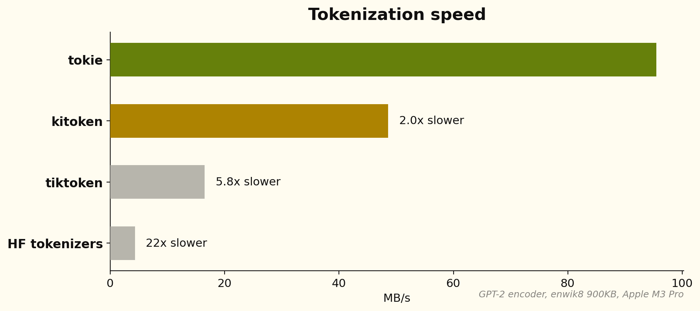
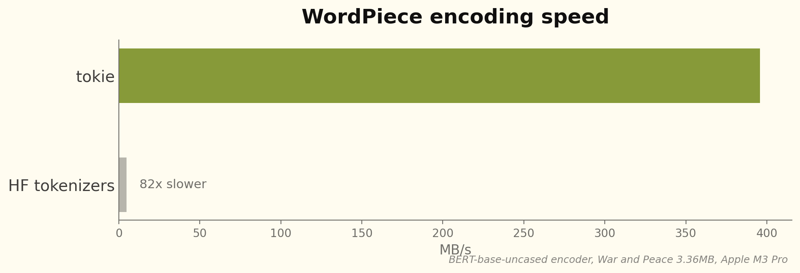
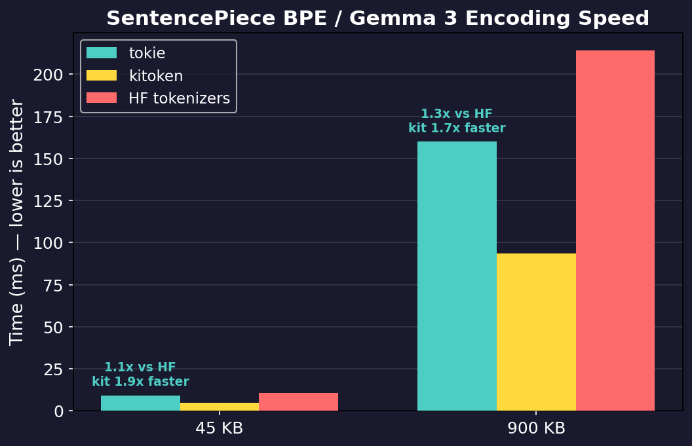
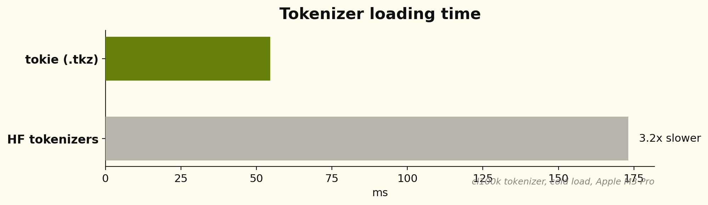

<div align="center">


# tokie

[](https://crates.io/crates/tokie)
[](https://pypi.org/project/tokie/)
[](https://crates.io/crates/tokie)
[](https://pypi.org/project/tokie/)
[](LICENSE-MIT)
[](https://docs.rs/tokie)
[](https://github.com/chonkie-inc/tokie)

*10-136x faster tokenization, 10x smaller models, 100% accurate drop-in for HuggingFace*

[Install](#install) •
[Quick Start](#quick-start) •
[Examples](#examples) •
[Benchmarks](#benchmarks) •
[Why tokie?](#why-tokie)

</div>

**tokie** is a Rust tokenizer library (with Python bindings) that can load any tokenizer on HuggingFace and tokenize up to 80x faster. It supports every major algorithm — BPE, WordPiece, SentencePiece, and Unigram — and is 100% token-accurate, every time.



## Install

### Python

```bash
pip install tokie
```

### Rust

```toml
[dependencies]
tokie = { version = "0.0.5", features = ["hf"] }
```

## Quick Start

### Python

```python
import tokie

# Load any HuggingFace tokenizer
tokenizer = tokie.Tokenizer.from_pretrained("bert-base-uncased")

# Encode — returns Encoding with ids, attention_mask, type_ids, tokens
encoding = tokenizer("Hello, world!")  # or tokenizer.encode("Hello, world!")
print(encoding.ids)             # [101, 7592, 1010, 2088, 999, 102]
print(encoding.tokens)          # ['[CLS]', 'hello', ',', 'world', '!', '[SEP]']
print(encoding.attention_mask)  # [1, 1, 1, 1, 1, 1]

# Decode
text = tokenizer.decode(encoding.ids)  # "hello , world !"

# Count tokens without allocating
count = tokenizer.count_tokens("Hello, world!")  # 6

# Batch encode (parallel across all cores)
encodings = tokenizer.encode_batch(["Hello!", "World"], add_special_tokens=True)
```

### Rust

```rust
use tokie::Tokenizer;

let tokenizer = Tokenizer::from_pretrained("bert-base-uncased")?;
let encoding = tokenizer.encode("Hello, world!", true);
println!("{:?}", encoding.ids);             // [101, 7592, 1010, 2088, 999, 102]
println!("{:?}", encoding.attention_mask);  // [1, 1, 1, 1, 1, 1]

let text = tokenizer.decode(&encoding.ids).unwrap();
```

## Examples

### Padding & Truncation

For ML inference, you need fixed-length inputs. tokie supports padding and truncation just like HuggingFace:

```python
tokenizer = tokie.Tokenizer.from_pretrained("bert-base-uncased")

# Truncate to max length
tokenizer.enable_truncation(max_length=128)

# Pad to fixed length (or use BatchLongest for dynamic padding)
tokenizer.enable_padding(length=128, pad_id=0)

# All outputs are now exactly 128 tokens
results = tokenizer.encode_batch(["Short text", "A much longer piece of text for testing"])
assert all(len(r) == 128 for r in results)

# attention_mask shows which tokens are real (1) vs padding (0)
print(results[0].attention_mask)  # [1, 1, 1, 1, 0, 0, 0, ...]
```

### Cross-Encoder Pair Encoding

For rerankers and cross-encoders that need sentence pairs with token type IDs:

```python
pair = tokenizer("How are you?", "I am fine.")  # or tokenizer.encode_pair(...)
pair.ids               # [101, 2129, 2024, 2017, 1029, 102, 1045, 2572, 2986, 1012, 102]
pair.attention_mask    # [1, 1, 1, 1, 1, 1, 1, 1, 1, 1, 1]
pair.type_ids          # [0, 0, 0, 0, 0, 0, 1, 1, 1, 1, 1]
pair.special_tokens_mask  # [1, 0, 0, 0, 0, 1, 0, 0, 0, 0, 1]
```

### Byte Offsets

Track where each token maps back to in the original text:

```python
enc = tokenizer.encode_with_offsets("Hello world")
for token_id, (start, end) in zip(enc.ids, enc.offsets):
    print(f"  token {token_id}: bytes [{start}:{end}]")
```

### Vocabulary Access

```python
tokenizer.vocab_size          # 30522
tokenizer.id_to_token(101)    # "[CLS]"
tokenizer.token_to_id("[SEP]")  # 102
vocab = tokenizer.get_vocab()   # {"[CLS]": 101, "[SEP]": 102, ...}
```

### Save and Load `.tkz` Files

tokie's binary format is ~10x smaller than `tokenizer.json` and loads in ~5ms:

```python
tokenizer.save("model.tkz")
tokenizer = tokie.Tokenizer.from_file("model.tkz")
```

`from_pretrained()` automatically tries `.tkz` first, falling back to `tokenizer.json`.

## Benchmarks

All benchmarks run on War and Peace (3.36 MB) on an Apple M3 Pro. tokie produces **identical output** to HuggingFace tokenizers — every token matches, every time.

### BPE Encoding (GPT-2, Llama, Mistral)

For tiktoken-style BPE models (GPT-2, cl100k, o200k, Llama 3), tokie uses a backtracking encoder built on an Aho-Corasick automaton. Instead of iteratively merging byte pairs, it does a greedy longest-match in O(n) time, with backtracking only when adjacent tokens form invalid pairs. Combined with parallel chunking across all cores, this gives **298 MB/s** — 51x faster than HuggingFace and 21x faster than tiktoken.


### WordPiece (BERT, MiniLM, BGE, GTE)

WordPiece tokenizers use a different algorithm — greedy longest-match prefix search over a vocabulary trie. tokie uses a pre-built Double-Array trie for O(n) lookup with excellent cache locality, combined with a custom BERT pretokenizer that avoids regex entirely. The result is **82x faster** than HuggingFace tokenizers on BERT, with identical output (737,710 tokens match exactly).



### SentencePiece BPE (T5, XLM-R, Gemma)

SentencePiece-style models use a different merge algorithm with non-topological rank orders. tokie uses a radix heap with O(1) amortized operations that exploits BPE's monotonic rank property. Text is chunked at metaspace boundaries using SIMD-accelerated splitting, then encoded in parallel. This gives **7.7x** faster throughput than HuggingFace tokenizers.



### Python Benchmarks (tokie vs HuggingFace tokenizers)

Run `python scripts/benchmark_vs_hf.py` to reproduce. All results on Apple M3 Pro, median of 10 runs.

| Model | Text Size | tokie | HF tokenizers | Speedup |
|-------|-----------|-------|---------------|---------|
| BERT | 45 KB | 0.15 ms | 9.15 ms | **61x** |
| BERT | 900 KB | 1.69 ms | 229 ms | **136x** |
| GPT-2 | 45 KB | 0.14 ms | 7.20 ms | **50x** |
| GPT-2 | 900 KB | 1.70 ms | 181 ms | **107x** |
| Llama 3 | 45 KB | 0.14 ms | 7.33 ms | **54x** |
| Llama 3 | 900 KB | 2.04 ms | 190 ms | **93x** |
| Qwen 3 | 45 KB | 0.15 ms | 8.18 ms | **54x** |
| Gemma 3 | 45 KB | 1.01 ms | 9.62 ms | **10x** |

100% token-accurate across all models. Batch encoding is 17-22x faster. Decoding is 7-32x faster.

### Tokenizer Loading

Loading a tokenizer from `tokenizer.json` requires JSON parsing, vocabulary construction, and — for BPE models — building the Aho-Corasick automaton from scratch. tiktoken similarly has to parse its BPE data and compile regex patterns on every load. tokie's `.tkz` binary format stores all of this pre-built: the Double-Array Aho-Corasick (DAAC) automaton state, the normalized vocabulary, and the encoder configuration are serialized directly. Loading becomes a near-zero-cost deserialization — no parsing, no construction — achieving **4x–9x faster** cold load times than HuggingFace and **2x–3x faster** than tiktoken.



## Why tokie?

When I started building [Chonkie](https://github.com/chonkie-inc/chonkie), the biggest bottleneck wasn't chunking — it was tokenization. We were spending more time counting tokens than actually chunking text.

tokie uses hand-written parsers for each pretokenization pattern — GPT-2, cl100k, o200k, BERT — that understand the exact character classes needed without the overhead of a general-purpose regex engine. That alone gets you a 10–20x speedup on pretokenization.

The second problem was that no single library could load everything. I actually tried to solve this before with [AutoTikTokenizer](https://github.com/bhavnick/autotiktokenizer), believing tiktoken's BPE engine could handle all of HuggingFace. I was wrong — you need fundamentally different algorithms for each encoder type: backtracking BPE for tiktoken-style models, heap-based BPE for models with non-topological merge orders, radix-heap BPE for SentencePiece, plus WordPiece and Unigram each with their own tricks.

The third insight was parallelism. Tokenization is embarrassingly parallel if you split text at the right boundaries. We use [chunk](https://github.com/chonkie-inc/chunk) to SIMD-split text into chunks that respect token boundaries, then encode each chunk on a separate core and concatenate. This gives near-linear scaling — about 5x on 8 cores.

Finally, we built the `.tkz` format to eliminate load-time overhead. A `tokenizer.json` file has to be parsed, validated, and used to reconstruct all the internal data structures (including the Aho-Corasick automaton, which is expensive to build for large vocabularies). The `.tkz` format stores the pre-built DAAC automaton, vocabulary, and configuration as a flat binary — loading is just deserialization, no construction required. This cuts load times from 150ms to 15ms for large models like O200K.

The result is **tokie** — one tokenizer to rule them all.

## Acknowledgements

tokie builds on ideas from [HuggingFace tokenizers](https://github.com/huggingface/tokenizers), [tiktoken](https://github.com/openai/tiktoken), [GitHub's rust-gems](https://github.com/github/rust-gems) (backtracking BPE via Aho-Corasick), and [chunk](https://github.com/chonkie-inc/chunk) (SIMD text splitting).

## Citation

If you use tokie in your research, please cite it as follows:

```bibtex
@software{tokie2025,
  author = {Minhas, Bhavnick},
  title = {tokie: Fast, correct tokenizer library for every HuggingFace model},
  year = {2025},
  publisher = {GitHub},
  howpublished = {\url{https://github.com/chonkie-inc/tokie}},
}
```
